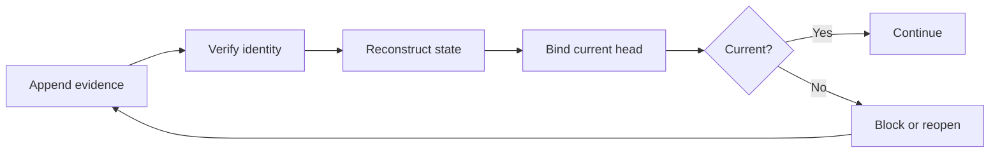
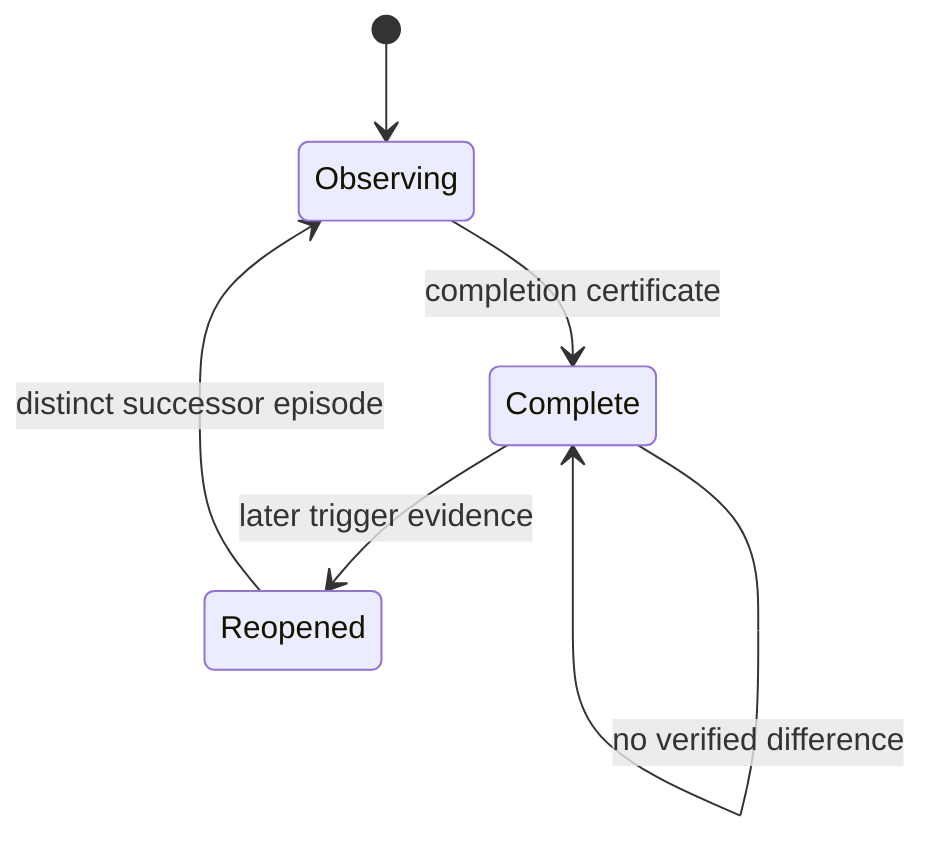
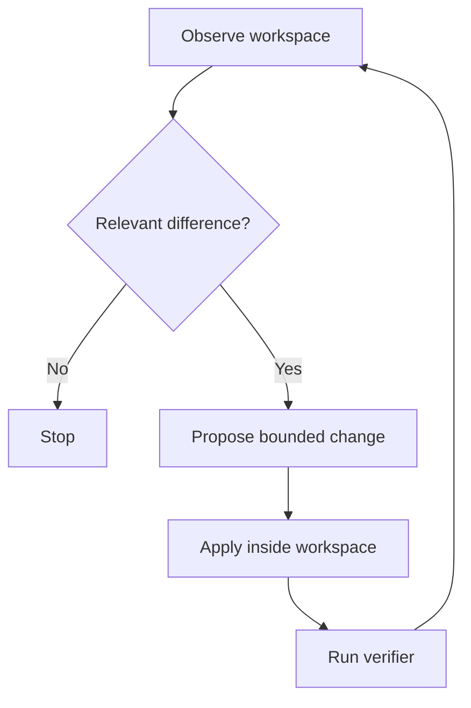

<div align="center">


# HOLO-Invariant

**AI continuity that preserves corrections instead of hiding them.**

[](https://www.python.org/)
[](https://github.com/Deathburgerz013/HOLO-Invariant/actions/workflows/test.yml)
[](#installation)
[](holosim/LICENSE)

</div>

```bash
pip install -e .
holo demo
```

One command creates disposable evidence, retains an original observation,
links a correction and revalidation, and opens the verified topology. It does
not modify an existing chain or grant truth, acceptance, write, or execution
authority.

### Benchmark any continuity system

Export a system-neutral condition document, then score it against the exact
committed fixture:

```bash
holo benchmark continuity --condition candidate.json
```

The [public fixture](benchmarks/continuity-v1.fixture.json) fixes the target
before results are observed. The [condition schema](schemas/continuity-condition.schema.json)
is closed so undeclared fields cannot alter the scoring contract.

| Ordinary stored state | HOLO continuity |
|---|---|
| Correction replaces history | Correction becomes a verified relation |
| Latest value hides its lineage | Original, correction, and target remain inspectable |
| Resume trusts supplied context | Resume checks externally retained evidence |
| Memory authority is implicit | Authority remains explicit and bounded |

HOLO-Invariant is a Python framework for preserving, reconstructing, and
checking state across sessions, models, tools, and execution environments.
It externalizes continuity into inspectable artifacts instead of assuming
that a model's context, memory, output, or confidence is authoritative.

> Store what happened. Preserve where it came from. Recheck what still
> applies. Grant no authority merely because a record exists.

HOLO is not a model, agent, vector database, or autonomous authority. It is a
set of deterministic boundaries for evidence, identity, replay, correction,
branching, validation, authorization, and bounded software work.

<!-- HOLO:STATUS:START -->
## Generated public status

<!-- Generated by python -m holosim.readme_status --write. Do not edit inside this boundary. -->

| Surface | Current repository state |
|---|---:|
| Package version | `0.4.9` |
| CLI commands | 17 |
| Public schemas | 3 |
| MCP tools | 1 |
| MCP resources | 2 |

**CLI:** `append`, `benchmark`, `check-spines`, `demo`, `doctor`, `health`, `idx-check`, `index`, `local-converge`, `operator-summary`, `replay`, `resume`, `review`, `serve`, `service-status`, `test`, `verify`

**Schemas:** `continuity-condition.schema.json`, `idx-check-receipt.schema.json`, `idx-spine-packet.schema.json`

**MCP tools:** `idx_check`

**MCP resources:** `holo://schemas/idx-check-receipt`, `holo://schemas/idx-spine-packet`
<!-- HOLO:STATUS:END -->

## The continuity path



The minimal spine is:

```text
append -> verify -> reconstruct -> bind -> gate -> continue or reopen
```

Each stage answers a different question. A stored event may be historically
present without being true. A valid receipt may be internally consistent
without being current. A current observation may still lack permission to
write or execute.

## What the code guarantees

Within each module's declared boundary, HOLO can verify properties such as:

- deterministic canonical JSON identity;
- append-only SHA-256-linked history;
- correction lineage that preserves the original record;
- exact-schema receipt validation;
- rejection of undeclared fields and rehashed forged bodies;
- deterministic replay and reconstruction measurements;
- current, stale, invalid, and unknown head classifications;
- immutable parent identity across branch and reopen relations;
- explicit separation between observation and authorization;
- independently signed, purpose-scoped, target-scoped, current,
  replay-protected execution permits;
- bounded workspace mutation followed by real verification and rechecking.

A passing verifier establishes only the property it checked.

## What the code does not claim

Hash equality proves identity under the declared canonical encoding. By
itself, it does not prove truth, authorship, relevance, completeness,
acceptance, or permission.

Unless a narrower module explicitly establishes otherwise, observational
outputs remain bounded as:

```json
{
  "accepted": false,
  "truth_claimed": false,
  "write_authority": "NONE",
  "execution_authority": "NONE"
}
```

HOLO does not claim to:

- preserve a mind or internal model state;
- make model output true;
- turn memory into acceptance;
- authenticate origin using an unsigned hash alone;
- establish a SLSA level by emitting an unsigned statement;
- authorize external effects using an observational receipt;
- discover an authoritative current head without supplied evidence;
- guarantee general intelligence, consciousness, or autonomous judgment.

## Why exact schemas matter

HOLO treats undeclared fields as a failed boundary, not harmless metadata.

```text
declared field + valid semantics + valid identity = eligible for verification
```

Adding `approval: "GRANTED"` to a receipt and recomputing its hash does not
make the receipt approved. The schema, semantics, lineage, and identity must
all verify. Authority remains a separate object and a separate check.

This rule is enforced across transformation receipts, validator receipts,
transition receipts, completion certificates, reopen receipts, framework
adapters, memory proposals, and provenance attestations.

## Current integration boundaries

The adapters are dependency-free protocol boundaries. They accept ordinary
Python mappings shaped like the external framework's data, then reuse HOLO's
verification rules.

| Integration | HOLO boundary | Preserved invariant |
|---|---|---|
| LangGraph | checkpoint envelope gate | A fork creates a new reopen relation; the verified parent is not rewritten. |
| Temporal | activity authorization gate | Verification and an independent replay-protected permit precede side effects. |
| Letta | memory proposal boundary | A memory edit remains a proposal and exposes no write operation. |
| in-toto / SLSA | provenance attestation bridge | Artifact and receipt identities are bound without claiming signature, truth, authority, or SLSA level. |

Every adapter is tested against the same hostile cases:

1. Undeclared fields cannot smuggle authority.
2. Rehashing a forged body does not make it valid.
3. Replay preserves artifact identity.
4. Branching preserves the parent.
5. External effects require separately verifiable authorization.

## Environment episodes

Completion is scoped to an observed window, not declared forever.



`environment_completion_evaluator.py` emits bounded completion certificates.
`environment_episode_reopen_receipt.py` preserves the completed parent while
binding later trigger evidence to a distinct successor episode. A reopen does
not rewrite the earlier window or grant mutation authority.

## Bounded software convergence

HOLO includes a real compare-build-verify-recompare loop:



The software path includes capability decomposition, planning, proposal,
bounded transformation, workspace verification, lineage reconstruction,
convergence, and an optional local Ollama transport. Model output is treated
as a proposal. The verifier and observed environment determine whether the
requested behavior was actually reached.

Run the disposable example:

```bash
python examples/software_convergence.py
```

Run the continuity handoff example:

```bash
python examples/end_to_end_continuity.py
```

## Installation

HOLO-Invariant requires Python 3.10 or newer and has no required runtime
dependencies.

```bash
git clone https://github.com/Deathburgerz013/HOLO-Invariant.git
cd HOLO-Invariant
python -m pip install -e .
```

Install test tooling:

```bash
python -m pip install -e ".[dev]"
```

Optional collection and embedding tools:

```bash
python -m pip install -e ".[collect]"
```

The `collect` extra installs `arxiv`, `sentence-transformers`, and
`scikit-learn`. These dependencies are optional and are not required for the
continuity core.

## Quick start

### Append and verify a local chain

```python
from holosim.core import HoloChain

chain = HoloChain("holo_memory.jsonl")
chain.append("Example continuity delta")

print(chain.health())
```

The chain file is local state. Git history or another independently retained
checkpoint can provide an external comparison point; the internal hash chain
alone establishes self-consistency, not independent authorship.

### Command line

The canonical CLI implementation is `holosim.holo_cli`; `holosim.cli` is the
compatibility entry point.

```bash
python -m holosim.cli health
python -m holosim.cli doctor
python -m holosim.cli verify
python -m holosim.cli replay --last 10
python -m holosim.cli test
```

Available subcommands:

```text
health
review
index
check-spines
test
doctor
operator-summary
service-status
verify
replay
append
local-converge
```

Appending through `HoloService` requires an external reviewer identity and
approval reference:

```bash
python -m holosim.cli append "Example delta" \
  --reviewer "reviewer-id" \
  --approval-reference "approval-record-id"
```

On Windows Command Prompt, enter the same command on one line.

### Fixed-point evaluator

```bash
python -m holosim.Holo_Sim identity
python -m holosim.Holo_Sim verify
python -m holosim.Holo_Sim evaluate "Example delta"
```

The symbolic relation `(C + I + E)^2` remains a project design mnemonic used
by this evaluator. It is not presented as a derived scientific law or as proof
of the repository's engineering guarantees.

### Local Ollama convergence

With Ollama already running locally:

```bash
python -m holosim.cli local-converge \
  "implement the requested behavior" \
  ./workspace \
  --model qwen2.5-coder:7b
```

The default endpoint is `http://127.0.0.1:11434/api/generate`. Workspace
changes remain bounded to the supplied directory and are evaluated through
the software convergence path.

## Architecture map

The package contains many small boundary modules rather than one monolithic
agent. The groups below are the supported map; the source tree remains the
complete inventory.

| Layer | Representative modules | Responsibility |
|---|---|---|
| Canonical identity | `canonical.py`, `check_identity.py`, `signed_occurrence.py` | Deterministic encoding, hashes, and authenticated occurrence records. |
| Persistence and replay | `core.py`, `replay.py`, `replay_verifier.py`, `slot_merkle_sqlite.py` | Append-only history, verification, replay, and alternate persistence. |
| Correction and uncertainty | `correction.py`, `correction_cycle.py`, `uncertainty_ledger.py`, `interpretation.py` | Preserve originals, bind corrections, and retain unresolved conflict. |
| Reconstruction | `reconstruction_benchmark.py`, `reconstructor.py`, `recovery.py`, `recovery_runner.py` | Measure and test what survives across handoffs. |
| Continuity gating | `continuity_compliance.py`, `continuity_head_binding.py`, `continuity_current_gate.py` | Build handoffs, bind them to verified heads, and fail closed. |
| Environment evaluation | `environment_snapshot.py`, `environment_snapshot_comparator.py`, `environment_completion_evaluator.py`, `environment_episode_reopen_receipt.py` | Observe windows, compare state, declare bounded completion, and reopen immutably. |
| Transformations | `bounded_transformation_engine.py`, `transition_receipt.py`, `state_transfer.py` | Apply bounded changes and verify exact receipt boundaries. |
| Software work | `software_builder.py`, `software_converger.py`, `software_project_orchestrator.py`, `bounded_python_workspace_verifier.py` | Propose, apply, test, compare, and stop. |
| Local model path | `local_ollama_adapter.py`, `local_ollama_capability_proposer.py`, `local_ollama_software_convergence.py` | Use local model output as bounded software proposals. |
| Framework bridges | `langgraph_checkpoint_envelope_gate.py`, `temporal_activity_authorization_gate.py`, `letta_memory_proposal_boundary.py`, `slsa_holo_provenance_attestation.py` | Carry HOLO boundaries into external execution and provenance shapes. |
| Spine protocol | `spine_protocol.py`, `spine_lineage.py`, `spine_feedback.py` | Parse, compare, transfer, and validate structured Spine documents without rewriting raw evidence. |
| Runtime and operations | `runtime.py`, `agent_runtime.py`, `operator.py`, `service.py`, `scheduler.py`, `watcher.py`, `sentinel.py` | Compose operational services around the verified boundaries. |
| Optional collection | `collector.py`, `embeddings.py`, `miner.py` | Gather and compare external material using optional dependencies. |

For detailed implementation history and review-bound evidence, see
[`docs/HOLO_Invariant_Implementation_Map.md`](docs/HOLO_Invariant_Implementation_Map.md).

## Verification

Run the complete test suite:

```bash
python -m pytest -q
```

Latest retained post-merge observation:

```text
1065 passed, 3 skipped
main commit: 5ba72ed
```

Evidence is preserved in the
[`main-5ba72ed-pytest-receipt.json`](docs/verification/main-5ba72ed-pytest-receipt.json) receipt and its separately
hashed [`main-5ba72ed-pytest.txt`](docs/verification/main-5ba72ed-pytest.txt) raw output. The
receipt is observational and grants no acceptance, truth, write, or execution
authority.

Run the integrated CLI self-test:

```bash
python -m holosim.cli test
```

Validate a rail-formatted Spine document:

```bash
python -m holosim.spine_protocol rail-validate path/to/document.md
```

Passing tests demonstrate the cases encoded by those tests. They do not grant
acceptance, certify every deployment environment, or replace external review.

## Development workflow

Repository changes follow a narrow, evidence-first loop:

```text
current main
  -> one named branch
  -> one reproducible failure
  -> smallest supported correction
  -> focused tests
  -> full suite
  -> diff checks
  -> external review
  -> merge
  -> post-merge verification
```

Automated assistants must follow [`AGENTS.md`](AGENTS.md). In particular:

- evaluation is not approval;
- raw evidence is not rewritten;
- changes begin from current `main` on a narrow branch;
- only the intended files are staged;
- merging requires explicit human direction;
- a passing check establishes only what it observed.

## Project status

HOLO-Invariant is an active experimental engineering project. Its strongest
claims are executable and testable: exact schemas, deterministic identities,
append-only lineage, fail-closed gates, bounded mutations, replay resistance,
and explicit authority separation.

Long-horizon performance across different models, providers, machines, and
operators remains an empirical question. Historical commits and retained
artifacts make those experiments comparable over time.

## License

MIT. See [`holosim/LICENSE`](holosim/LICENSE).

## Author

Canyon Brock Haney

Holo/Sim Continuity Engine conception: July 27, 2025.

<div align="center">


</div>
